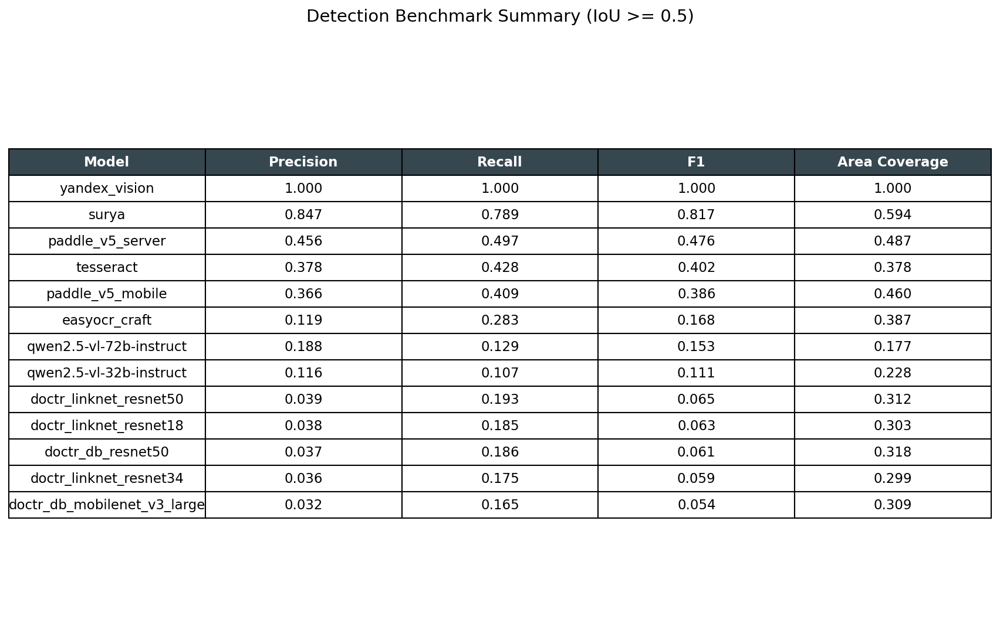
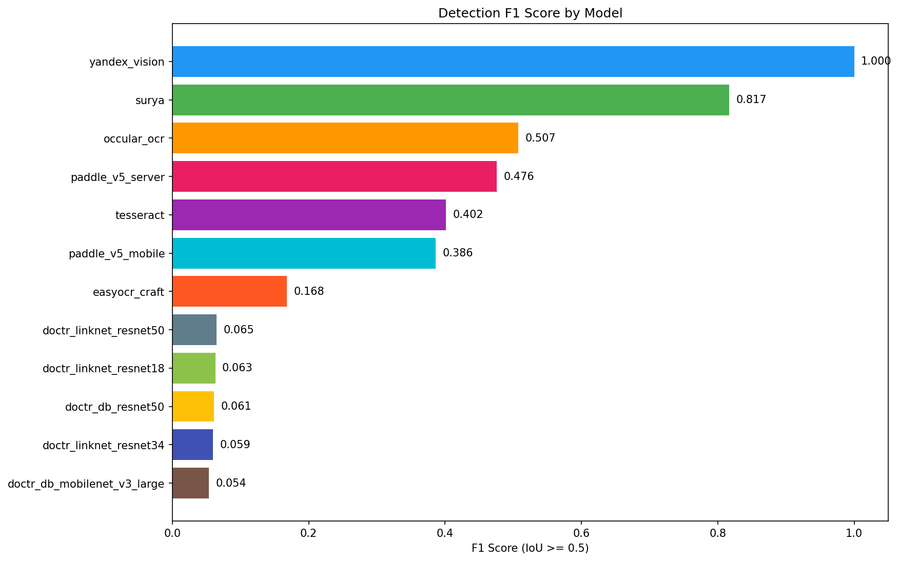
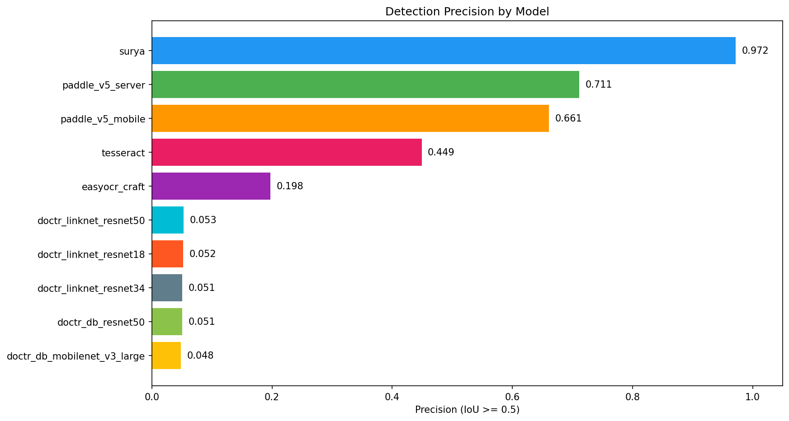
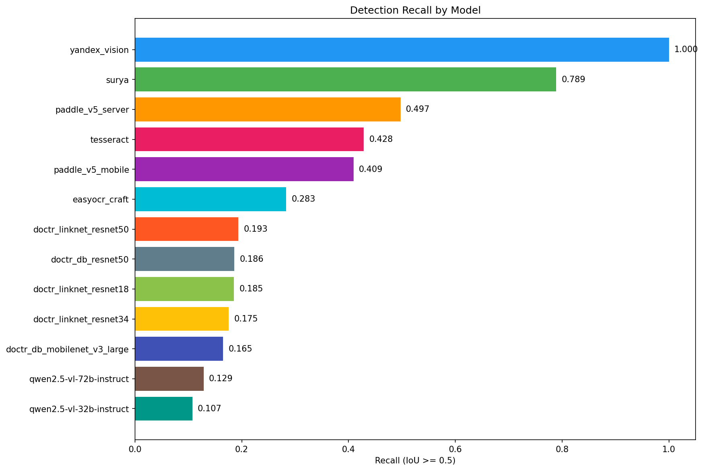
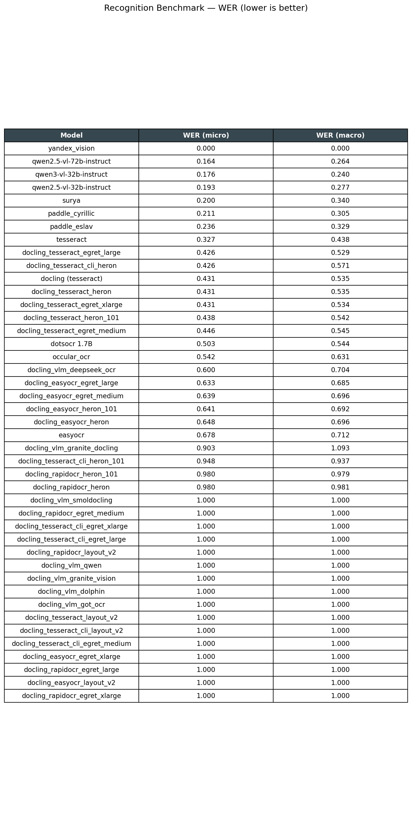
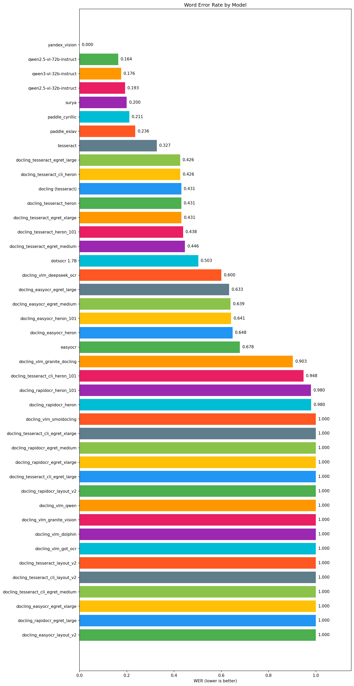

# OCR Benchmark

Бенчмарк детекции и распознавания текста на датасете из 113 изображений документов с 4178 размеченными строками (CVAT XML).

## Detection









## Recognition





## Модели

### Detection

| Модель | Детектор | Гранулярность |
|--------|----------|---------------|
| Surya 0.13.1 | Segformer | Строки |
| PaddleOCR PP-OCRv5 server | DB | Строки |
| PaddleOCR PP-OCRv5 mobile | DB | Строки |
| Tesseract 5 | LSTM + merging | Строки (мердж слов) |
| EasyOCR | CRAFT | Фрагменты строк |
| doctr (5 архитектур) | DB / LinkNet | Слова |

### Recognition

| Модель | Движок | Примечание |
|--------|--------|------------|
| Surya 0.13.1 | Собственный | GPU |
| PaddleOCR cyrillic | PP-OCRv4 (rs_cyrillic) | CPU |
| PaddleOCR eslav | PP-OCRv4 (ru) | CPU |
| Tesseract 5 | LSTM | CPU |
| Docling | Tesseract (через docling pipeline) | CPU |
| dots.ocr 1.7B | VLM через vLLM | GPU |
| EasyOCR | CRNN | GPU |

## Метрики

### Detection
- **Precision** — доля предсказанных боксов, совпавших с GT (IoU >= 0.5)
- **Recall** — доля GT боксов, найденных моделью (IoU >= 0.5)
- **F1** — гармоническое среднее precision и recall
- **Area Coverage** — средний максимальный IoU для каждого GT бокса

Matching: венгерский алгоритм (оптимальное назначение).

### Recognition
- **WER (micro)** — Word Error Rate на объединённом тексте всех изображений
- **WER (macro)** — среднее WER по изображениям

## Структура

```
src/detectors/       # Обёртки детекторов
src/recognizers/     # Обёртки распознавателей
src/metrics.py       # IoU, matching, precision/recall/F1
src/recognition_metrics.py  # WER
scripts/             # Запуск моделей, метрик, дашбордов
predictions/         # Сохранённые результаты моделей (JSON)
results/             # Вычисленные метрики
dashboard/           # Графики detection + recognition
```
